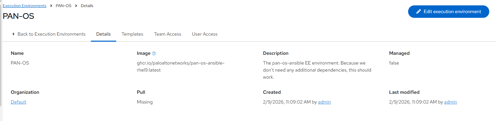
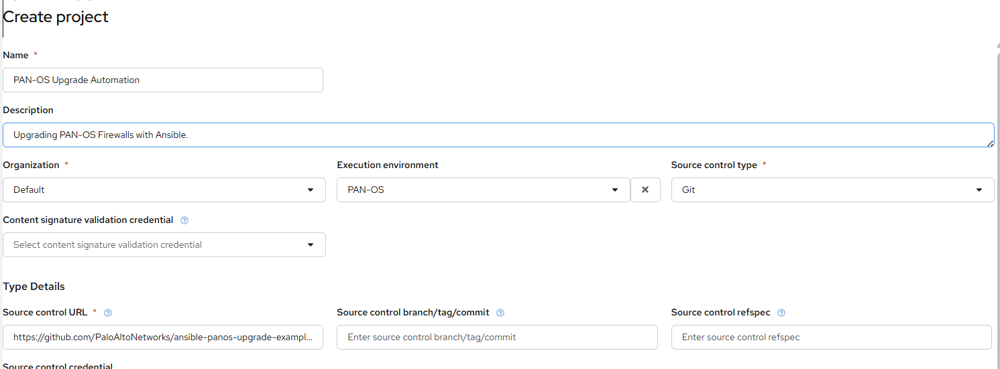

# Ansible Upgrade Automation Example

This repository serves as an example for how you might use the PAN-OS Ansible collection to upgrade firewalls.

It is provided AS-IS with no formal support.

For more information, contact Palo Alto Networks Professional Services.

## AAP/AWX Setup

## Configure the PAN-OS Ansible EE image as an execution environment

### Setup a Project

